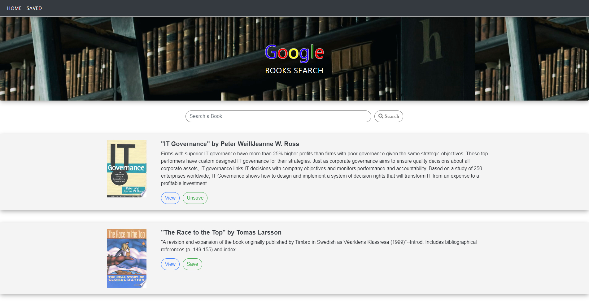

# Google-Books-Search

**Full stack application**

**Unit 20: React Assignment**

**Description:**

React-based Google Books Search app that displays books on user searches. Users can save them to review or purchase later.

**Link to Heroku and Github Deployments:**

https://clicky-game-yuriy.herokuapp.com/

https://google-books-search-yuriy.herokuapp.com

**Languages & Technologies used:**

MERN - MongoDB, Express.js, React.js, Node.js, Google Books API. 

Enjoy
